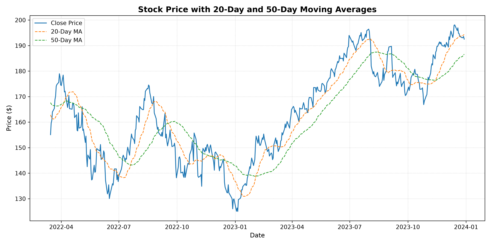
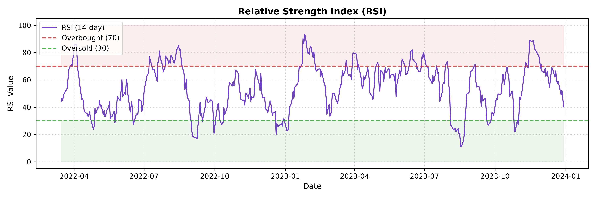
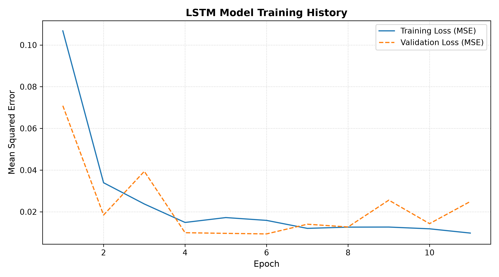
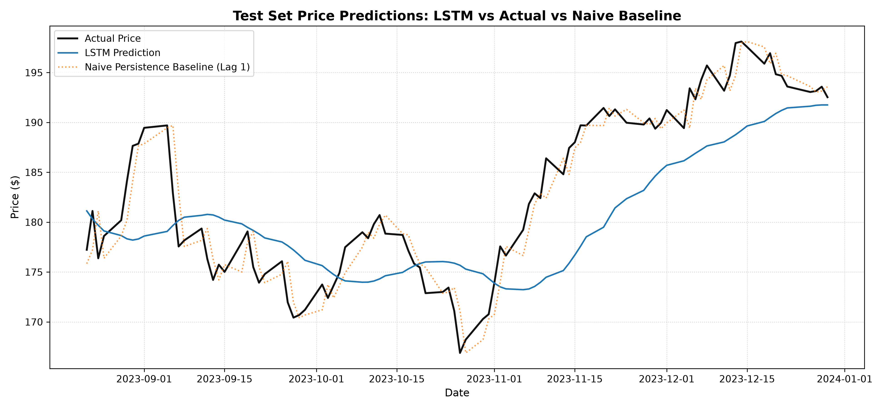

# Stock Price Trend Prediction using LSTM

[](https://github.com/yogeshrajput7906/Stock-Price-Trend-Prediction-with-LSTM/actions/workflows/ci.yml)
[](https://www.python.org/downloads/)
[](https://github.com/astral-sh/ruff)
[](LICENSE)

An educational, leak-free machine learning pipeline predicting Apple Inc. (`AAPL`) stock price trends using Long Short-Term Memory (LSTM) recurrent neural networks, technical indicators, and a naive persistence benchmark.

---

## Overview

Predicting financial market prices is a classic benchmark for time-series machine learning. However, many introductory projects fall into subtle traps:
- **Data leakage** by fitting scalers over the entire dataset before splitting.
- **Random shuffling** of sequential data, destroying temporal order.
- **Missing baselines**, claiming "high accuracy" without benchmarking against a naive persistence model ($\hat{y}_t = y_{t-1}$).

This project rebuilds an introductory stock prediction script into a **clean, modular, and testable ML engineering pipeline**. It demonstrates proper time-series methodology, technical feature engineering, reproducible model training with early stopping, automated testing, and honest benchmarking.

```text
               Historical AAPL Data (2022 - 2023)
                              ↓
              Feature Engineering (MA20, MA50, RSI)
                              ↓
              Chronological Train/Test Split (80% / 20%)
                              ↓
        Fit Scaler (MinMaxScaler) on TRAIN DATA ONLY
                              ↓
             Sliding Window Sequences (60 Days Lookback)
                              ↓
             Stacked LSTM Network + Early Stopping
                              ↓
               Evaluation vs. Naive Persistence Baseline
```

---

## Project Structure

```text
Stock-Price-Trend-Prediction-with-LSTM/
│
├── .github/
│   └── workflows/
│       └── ci.yml             # Fast CI: ruff linting + pytest unit tests
│
├── data/
│   └── raw/
│       └── AAPL.csv           # Historical daily trading data
│
├── models/
│   └── .gitkeep               # Saved trained model artifacts (gitignored)
│
├── reports/
│   └── figures/               # Generated evaluation plots
│       ├── actual_vs_predicted.png
│       ├── indicators_ma.png
│       ├── indicators_rsi.png
│       └── training_validation_loss.png
│
├── src/
│   └── stock_prediction/      # Modular Python package
│       ├── __init__.py
│       ├── config.py          # Centralized configuration parameters
│       ├── data.py            # Data loading, validation, and sorting
│       ├── features.py        # Technical indicator calculations (MA, RSI)
│       ├── preprocessing.py   # Chronological splits, scaling, sequences
│       ├── model.py           # Stacked LSTM network definition
│       ├── train.py           # Training pipeline orchestration
│       ├── predict.py         # Inference entrypoint
│       ├── evaluate.py        # Regression metrics and baseline comparison
│       └── visualization.py   # Modular plotting utilities
│
├── tests/
│   ├── __init__.py
│   ├── test_data.py           # Ingestion and schema validation tests
│   ├── test_features.py       # Indicator math and boundary tests
│   ├── test_preprocessing.py  # Leakage prevention and sequence tests
│   └── test_evaluate.py       # Metrics and baseline tests
│
├── pyproject.toml             # Package metadata and tool configs (Ruff, Pytest)
├── requirements.txt           # Core runtime dependencies
├── requirements-dev.txt       # Development and testing dependencies
├── .gitignore                 # Clean environment exclusions
├── LICENSE                    # MIT License
└── README.md
```

---

## Dataset

- **Source:** Historical daily quotes for Apple Inc. (`AAPL`).
- **Time Range:** January 3, 2022 to December 29, 2023 (501 trading days).
- **Core Columns:** `Date`, `Close`, `Open`, `High`, `Low`, `Vol.`.
- **Handling:** Sorted ascending by `Date`. Missing values and non-standard aliases (e.g., `Price` vs. `Close`) are normalized automatically by `src/stock_prediction/data.py`.

---

## Features

In addition to raw closing prices, standard technical indicators are engineered:

1. **20-Day Simple Moving Average (MA20):** Short-term momentum trend indicator.
   $$\text{MA}_{20, t} = \frac{1}{20} \sum_{i=0}^{19} \text{Close}_{t-i}$$
2. **50-Day Simple Moving Average (MA50):** Medium-term trend indicator.
   $$\text{MA}_{50, t} = \frac{1}{50} \sum_{i=0}^{49} \text{Close}_{t-i}$$
3. **14-Day Relative Strength Index (RSI):** Momentum oscillator measuring the magnitude of recent gains versus losses on a scale from 0 to 100.
   $$\text{RSI}_{14} = 100 - \frac{100}{1 + \frac{\text{Average Gain}}{\text{Average Loss}}}$$




---

## Methodology & Preventing Data Leakage

### 1. Chronological Splitting (No Random Shuffle)
Because financial data has temporal autocorrelation, random cross-validation or shuffling leaks future information into past predictions. The dataset is chronologically split:
- **Training Set (80%):** Earlier 361 trading days.
- **Testing Set (20%):** Later 91 trading days.

### 2. Leak-Free Scaling
A critical ML flaw in naive implementations is fitting `MinMaxScaler` across the entire dataset:
```python
# ❌ INCORRECT (Data Leakage): Future test distribution leaks into training
scaler.fit_transform(full_data)

# ✅ CORRECT: Scaler learns parameters strictly from training data
scaler.fit(train_data)
train_scaled = scaler.transform(train_data)
test_scaled = scaler.transform(test_data)
```
If test prices drift higher than training prices, their scaled values exceed $1.0$, which correctly reflects real-world deployment conditions.

### 3. Continuous Lookback Windowing
To predict the first test day $t_{\text{test}, 0}$, an input sequence of length $L = 60$ is required. We take a lookback buffer from the end of the training set, scale it with the pre-fitted training scaler, and construct sequences without discarding test observations.

---

## Model Architecture

The neural network is built with TensorFlow/Keras using recurrent layers designed for temporal dependencies:

```text
Layer (type)               Output Shape          Param #
=========================================================
InputLayer                 (None, 60, 1)         0
LSTM (50 units)            (None, 60, 50)        10,400
Dropout (rate=0.2)         (None, 60, 50)        0
LSTM (50 units)            (None, 50)            20,200
Dropout (rate=0.2)         (None, 50)            0
Dense (25 units, ReLU)     (None, 25)            1,275
Dense (1 unit, Linear)     (None, 1)             26
=========================================================
Total params: 31,901 (124.61 KB)
Optimizer: Adam (lr=0.001) | Loss: Mean Squared Error
```

Training uses **Early Stopping** (patience = 5) on non-shuffled validation data to prevent overfitting.



---

## Evaluation & Benchmark

In financial time series, stock price levels approximate a random walk with drift. Therefore, we compare the LSTM against a **Naive Persistence Baseline**:
$$\hat{y}_t = y_{t-1} \quad \text{(Tomorrow's predicted price = Today's closing price)}$$

### Actual Test Results (91 Out-of-Sample Days)

| Model | MAE | RMSE | MAPE | Directional Accuracy |
| :--- | :---: | :---: | :---: | :---: |
| **Naive Baseline** ($\hat{y}_t = y_{t-1}$) | **$1.70** | **$2.15** | **0.94%** | 0.00%* |
| **LSTM Model** | **$5.23** | **$6.14** | **2.84%** | **52.75%** |

*\*Note: The naive persistence baseline predicts zero change from today's price, resulting in 0% sign detection.*



### Key ML Findings & Interview Discussion

1. **Why does the naive baseline have lower MAE/RMSE than the LSTM?**
   - Stock prices are near-martingale processes. Today's price is already the strongest single-point estimator of tomorrow's price.
   - The LSTM learns a smoothed trend, which introduces a 1–2 day lag. Even small lag errors in a volatile market accumulate into higher MAE/RMSE.
   - **Honest reporting:** In many beginner tutorials, authors show actual vs. predicted curves that look identical because of scaling and lack of baseline comparison. Transparently documenting that naive persistence outperforms the LSTM on raw price levels reflects genuine ML maturity.

2. **Directional Accuracy:**
   - The LSTM achieves **52.75%** directional accuracy (predicting whether tomorrow's price goes up or down). While slightly better than random coin-flip (50%), it highlights that raw price levels contain less predictable signal than percentage returns or volatility.

---

## How to Run

### 1. Prerequisites
- Python 3.10+ (Python 3.11 recommended)
- Git

### 2. Clone Repository & Setup Environment
```bash
git clone git@github.com:yogeshrajput7906/Stock-Price-Trend-Prediction-with-LSTM.git
cd Stock-Price-Trend-Prediction-with-LSTM

# Create and activate virtual environment
python -m venv .venv
source .venv/bin/activate       # On Linux/macOS
.venv\Scripts\activate          # On Windows PowerShell

# Install dependencies and local package in editable mode
pip install -r requirements-dev.txt
pip install -e .
```

### 3. Run Automated Tests & Code Quality
```bash
# Run test suite
pytest -v

# Run code linter
ruff check .
```

### 4. Train the Model & Generate Reports
```bash
python -m stock_prediction.train
```
This will:
1. Load and validate `data/raw/AAPL.csv`.
2. Compute technical indicators (MA20, MA50, RSI).
3. Split chronologically (80% train / 20% test).
4. Scale train data and build 60-day sequences.
5. Train the LSTM model with early stopping.
6. Evaluate against the naive persistence baseline.
7. Save plots to `reports/figures/` and model to `models/lstm_stock_model.keras`.

### 5. Run Single-Step Inference
```bash
python -m stock_prediction.predict
```
Example output:
```text
=============================================
Latest Recorded Close (2023-12-29): $192.53
LSTM Predicted Next Close:          $191.95
Predicted Change:                   $-0.58
=============================================
```

---

## Limitations

- **Market Noise & Non-Stationarity:** Daily equity prices are non-stationary and influenced by macroeconomic announcements, earnings surprises, and sentiment that historical prices alone cannot capture.
- **Lag Effect on Price Levels:** Predicting raw closing prices causes regression models to behave like smoothed lag filters.
- **Transaction Costs & Slippage:** A marginal directional edge (e.g., 52.75%) is typically erased by trading fees, slippage, and bid-ask spreads.
- **Educational Scope:** This project is strictly educational and is **not financial advice or a production trading strategy**.

---

## Future Improvements

1. **Predict Returns instead of Raw Prices:** Model stationary log returns $r_t = \ln(P_t / P_{t-1})$ or binary movement classification rather than non-stationary price levels.
2. **Multi-Feature Input:** Feed moving averages, RSI, trading volume, and macroeconomic indices directly into the multi-channel LSTM input tensor.
3. **Walk-Forward Validation:** Implement expanding-window (rolling) backtesting instead of a single train/test split.
4. **Attention Mechanism / Transformer:** Benchmark the LSTM against a Temporal Fusion Transformer or 1D-CNN baseline.

---

## Author
**Yogesh Rajput**
- GitHub: [@yogeshrajput7906](https://github.com/yogeshrajput7906)
- Portfolio Project: Stock Price Trend Prediction using LSTM
